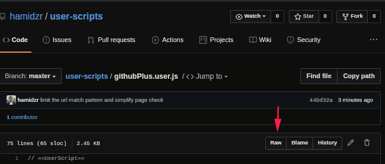
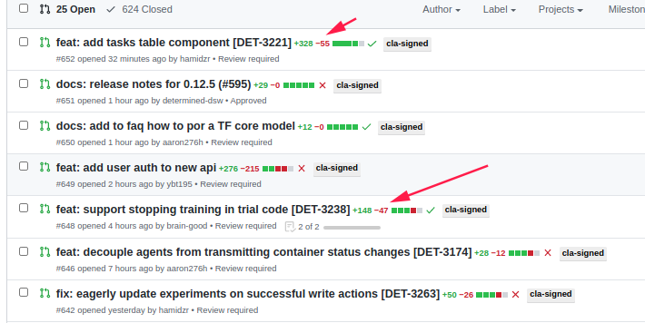

# Hamid's User Scripts

What is a browser userscript? [Wikipedia article](https://en.wikipedia.org/wiki/Userscript)

To start using a user scripts here with [Tampermonkey](https://www.tampermonkey.net/),
after installing the extension just point browser to the raw view of one of these scripts.

## GitHub ++

## TODO

- [ ] feat: select a list of elements: reorder or filter them
- [ ] migrate from gists
- [x] linter
