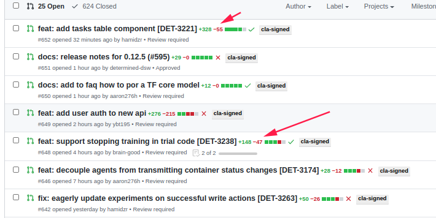

# Hamid's User Scripts

What is a browser userscript? [Wikipedia article](https://en.wikipedia.org/wiki/Userscript)

> **Note**: these scripts are now maintained as TypeScript source in a separate
> repository and transpiled to the `.user.js` files you see here. Edit the
> TypeScript source, not the built files.

To start using a user scripts here with [Tampermonkey](https://www.tampermonkey.net/),
after installing the extension just point browser to the raw view of one of these scripts.

## GitHub ++

