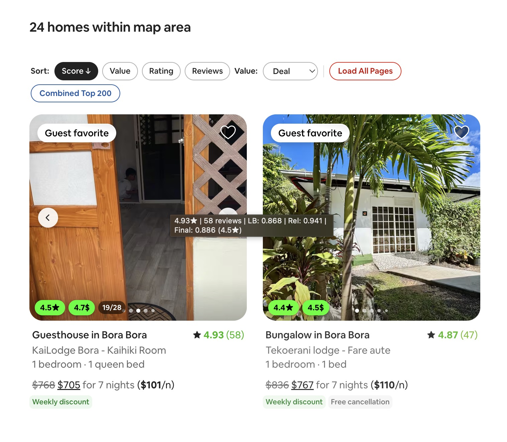

# Airbnb Scripts

This folder contains two public Airbnb userscripts:

- `Airbnb Property Plus` for listing pages at `https://www.airbnb.com/rooms/*`
- `Airbnb Listing Score` for search results at `https://www.airbnb.com/s/*`

## Airbnb Property Plus

Adds faster controls and better context on property pages.

### Features

- floating quick-actions bar with:
  - `Open map`
  - `Message host`
  - `Show all reviews`
  - `Search reviews`
  - `Copy reviews`
- draggable quick-actions bar with saved position in `localStorage`
- draggable map panel with:
  - Google Maps handoff
  - embedded map preview
  - coordinate copy
  - approximate vs exact pin labeling when Airbnb only exposes area-level data
- message template bar in the host contact flow:
  - ships with a default internet-speed template
  - supports create, update, and delete
  - personalizes the greeting when a host name is available
  - stores templates in `localStorage`
- inline derived nightly price next to Airbnb's total stay price copy
- wider content layout on large screens

### Storage

- `ab-property-plus-message-templates-v1`
- `ab-property-plus-floating-pos-v1`

## Airbnb Listing Score

Adds ranking, value scoring, and sorting controls on Airbnb search result grids.

### Features

- computes a score per listing from:
  - Wilson lower-bound confidence on rating and review count
  - a page-relative rank blend
- adds color-coded score pills on listing cards
- dims weaker cards and colors rating and review-count text by relative strength
- derives nightly rates from Airbnb price text and shows them inline on cards
- adds a sort bar with toggles for:
  - `Score`
  - `Value`
  - `Rating`
  - `Reviews`
- supports two value models:
  - `Nightly blend`
  - `Score-relative price`
- persists score sort mode and value model in `localStorage`
- `Load All Pages` fetches additional search pages and recomputes scores globally
- `Combined Top 200` opens an aggregated overlay with merged listings, photos, and independent sort controls
- removes the `Available for similar dates` result section before sorting so it does not pollute the ranking
- reprocesses cards across Airbnb SPA navigation and lazy rendering

### Storage

- `ab-score-settings-v1`

### Screenshots

Grid scoring on search results:

Aggregated combined view:

## Limitations

- both scripts depend on Airbnb DOM structure and internal data payloads that can change without notice
- some controls rely on Airbnb experiments, locale-specific labels, or data that may not be present on every page
