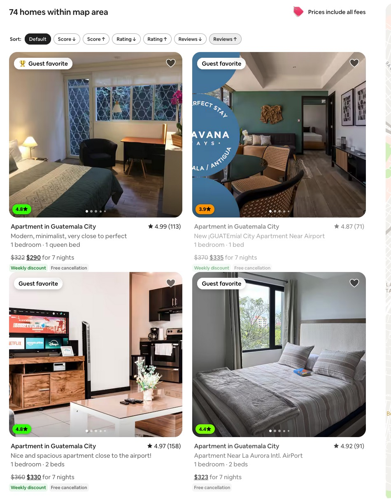

# Airbnb Property Plus

This userscript adds high-signal controls to Airbnb property pages so common actions are faster and key pricing context is easier to spot.

## What it does

- adds a floating quick-actions bar for common listing page actions
- adds reusable message templates in the host contact flow
- shows derived nightly pricing inline near Airbnb's total price copy
- makes the page denser on wider screens

## Demo

