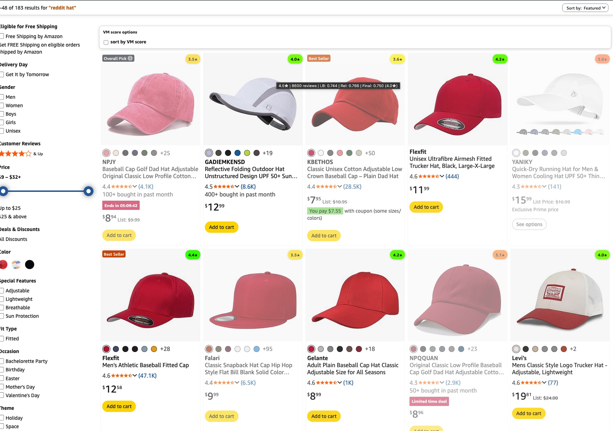

# Amazon Review Score Color Borders

This userscript makes Amazon result pages easier to scan by scoring listings with review-aware borders instead of relying on star rating alone.

## What it does

- scores items using review count and star rating together
- adds color-coded borders so stronger listings stand out quickly
- works on search results and bestseller-style listing pages

## Demo

