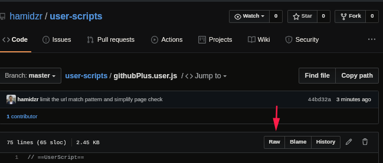

# GitHub Userscripts

This directory contains two public GitHub userscripts focused on pull request workflows.

## GitHub Status Checks

Reorders pull request status checks so failures and in-progress items appear first.

## GitHub PullRequests Plus

Adds per-pull-request additions and deletions next to links in pull request lists.

